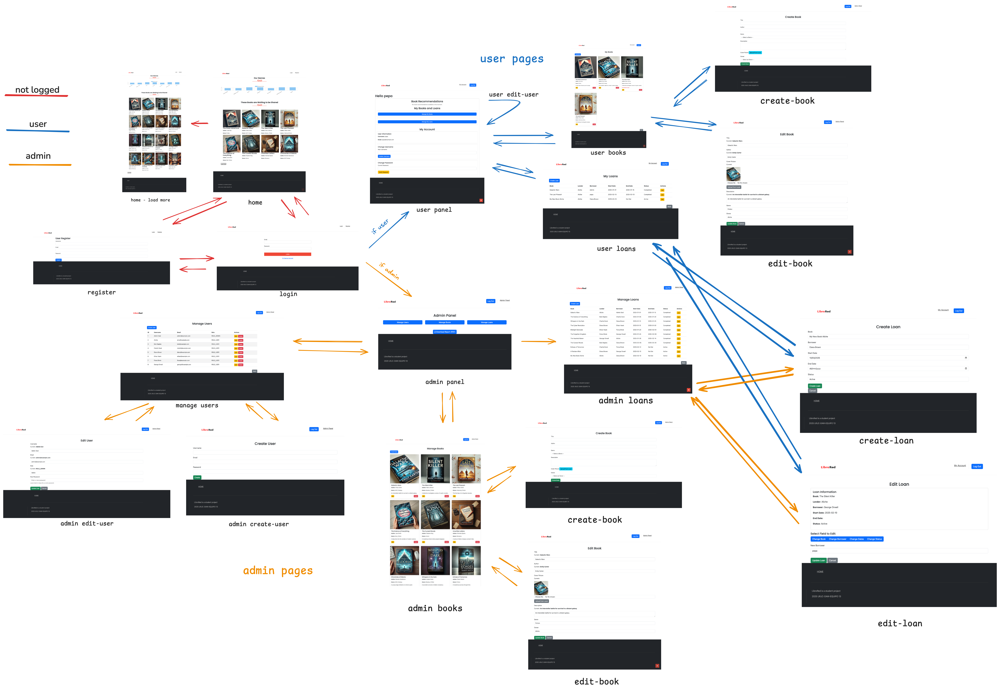
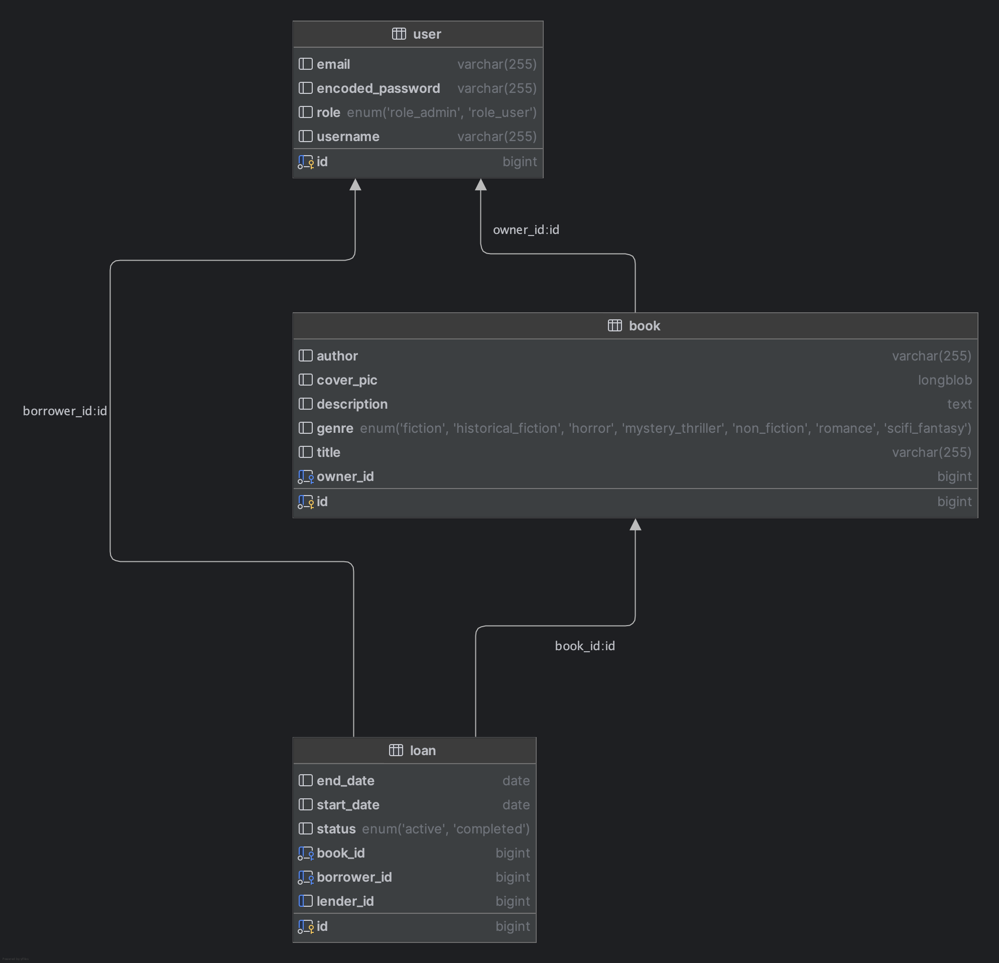
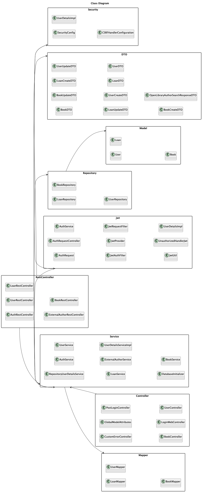

# 📚 LibroRed - Web Application for Book Lending Between Individuals

---

## Development Team Members (Team 13)

- **First Name**: Ana María
- **Last Name**: Jurado Crespo
- **Official University Email**: [am.juradoc@alumnos.urjc.es](mailto:am.juradoc@alumnos.urjc.es)
- **GitHub Account**: [medinaymedia](https://github.com/medinaymedia)

---

## Application Description

### 1️⃣ Application Entities

#### User
Represents the platform's users, who can be **lenders** and/or **borrowers**.
- A **lender** is a user who has books available for lending.
- A **borrower** is the person who receives a book on loan.  
  There are three types of users: **Anonymous, Registered, and Admin**.

#### Book
Represents the books available for lending.

#### Loan
Represents the process of borrowing a book between two users.

#### 🔗 Relationships Between Entities

- **User ↔ Book**: A user can have multiple books available for lending.
- **User ↔ Loan**: A loan connects two users: the **lender** (owner of the book) and the **borrower** (who receives the book).
- **Loan ↔ Book**: Each loan is associated with a specific book.

---

### 2️⃣ User Permissions

- **Anonymous User**: Can browse basic information about available books but cannot request loans or create books.
- **Registered User**: Can offer books for lending, request loans. They manage their own books and loans.
- **Administrator User**: Has full control over the platform, including user, loan and book management.

---

### 3️⃣ Images

- **Book**: Each book will have a single associated cover image.

---

### 4️⃣ Graphs 

Each user will be able to view:

** Books by Genre Graph**: A bar chart representing the number of books available in each genre.

---

### 5️⃣ Additional Features

** PDF Export of Database Information for Admins**  
Generates a PDF containing details of **Users, Books, and Loans**.

---

### 6️⃣ Advanced Algorithm

** Book Recommendation Algorithm**

#### How It Works
1. **User’s Book Preferences Analysis**: Identifies the genres of books registered by the user.
2. **User’s Loan History Analysis**: Identifies the genres of books the user has borrowed.
3. **Recommendation Generation**: The system suggests books aligned with the user's interests.

---

# Application

## Navigation Diagram


[Link to Exaclidraw](https://excalidraw.com/#json=630FFVgKYQWqjaHvjUj_Y,McZxkSjNhwxS2j8aCc2-mw)

## DB Entity Diagram

Here is the entity diagram image of librored DB



## Structured Class Diagram (updated)




---
# How to Configure your Environment (MacOs)
To configure and run the Spring Boot application in a completely new environment on macOS, follow these detailed instructions:

### 1. Install Homebrew
Homebrew is a package manager for macOS that simplifies the installation of software.

```sh
/bin/bash -c "$(curl -fsSL https://raw.githubusercontent.com/Homebrew/install/HEAD/install.sh)"
```

### 2. Install Java Development Kit (JDK)
Install the latest version of OpenJDK.

```sh
brew install openjdk
```

Add the JDK to your PATH:

```sh
echo 'export PATH="/usr/local/opt/openjdk/bin:$PATH"' >> ~/.zshrc
source ~/.zshrc
```

### 3. Install Maven
Maven is a build automation tool used for Java projects.

```sh
brew install maven
```

### 4. Install MySQL
Install MySQL server.

```sh
brew install mysql
```

Start MySQL server:

```sh
brew services start mysql
```

Secure MySQL installation (optional but recommended):

```sh
mysql_secure_installation
```

### 5. Clone the Repository
Clone the project repository from GitHub.

```sh
git clone https://github.com/medinaymedia/your-repo-name.git
cd your-repo-name
```

### 6. Configure the Database
Create a new MySQL database and user for the application.

```sh
mysql -u root -p
```

Inside the MySQL shell, run:

```sql
CREATE DATABASE librored;
CREATE USER 'librored_user'@'localhost' IDENTIFIED BY 'rawPassword';
GRANT ALL PRIVILEGES ON librored.* TO 'librored_user'@'localhost';
FLUSH PRIVILEGES;
EXIT;
```

### 7. Update Application Properties
Update the `application.properties` file with your database configuration. This file is typically located in `src/main/resources/application.properties`.

```properties
spring.datasource.url=jdbc:mysql://localhost:3306/librored
spring.datasource.username=librored_user
spring.datasource.password=password
spring.jpa.hibernate.ddl-auto=update
```

### 8. Build and Run the Application
Use Maven to build and run the Spring Boot application.

```sh
mvn clean install
mvn spring-boot:run
```

### 9. Access the Application
Once the application is running, you can access it in your web browser at:

```
https://localhost:8443
```

### 10. Additional Configuration
If your application uses HTTPS, ensure you have the keystore file (`keystore.jks`) in the appropriate location and update the `application.properties` file accordingly.

```properties
server.port=8443
server.ssl.key-store=classpath:keystore.jks
server.ssl.key-store-password=your_keystore_password
server.ssl.key-password=your_key_password
```

By following these steps, you should be able to configure and run the Spring Boot application in a new macOS environment.

# API REST 

An API REST has been implemented to manage the application's data. There is Postman collection file with the different endpoints and examples of how to use them.
You can also find the documentation of the API in the following links: 

[api-docs.html](https://rawcdn.githack.com/CodeURJC-DAW-2024-25/webapp13/refs/heads/main/api-docs/api-docs.html)

[api-docs.yaml](https://rawcdn.githack.com/CodeURJC-DAW-2024-25/webapp13/aec192a99ac67649566f22ff8653613e032db3db/api-docs/api-docs.yaml)


# Docker 
Here’s your Markdown snippet, ready to copy and paste into your `README.md`:

---

## Running the Application with Docker Compose

### Requirements

- Docker installed on your system
- Docker Compose installed (or Docker Desktop with Compose integrated)

### Run Instructions

1. Open a terminal at the root of the project (where `docker-compose.yml` is located).
2. Run the following command:

```bash
docker-compose up --build
```

3. Wait for all services to start. Once the backend is ready, the application will be accessible at:

```
https://localhost:8443
```

> You may need to accept the self-signed certificate if your browser blocks access initially.

---

## Building the Docker Image

### Requirements

- Docker must be installed and running

### Build & Publish Instructions

1. To build the Docker image, run the provided script (usually from the root of the backend folder):

```bash
./build-docker.sh
```

2. If you want to push the image to Docker Hub (make sure you're logged in):

```bash
docker push your-dockerhub-username/your-image-name:tag
```

> Replace `your-dockerhub-username`, `your-image-name`, and `tag` with your actual values.

---

Let me know if you want this localized into Spanish or auto-filled with your image name or script path.

# Virtual Machine

Here’s a concise summary in **English** with **Markdown formatting**, ready to copy-paste into a `README.md`, an email, or a report:

---

## What I accomplished in the virtual machine

- Successfully accessed the assigned virtual machine via SSH from MyApps.
- Created and executed a custom `install_docker.sh` script.
- Installed **Docker Engine** and **Docker Compose** without errors.
- Verified that Docker and Docker Compose were working correctly (`hello-world`, version checks).

---

## Problems uploading and deploying the application

- **Could not use `git clone`**: encountered issues with both HTTPS and SSH access.
- **Uploaded `.zip` via email** to the MyApps Windows environment, but:
  - Had no direct way to transfer the code to the VM from there.
  - Tried using `scp` from Windows to the VM, but couldn’t confirm the host (`yes`) due to keyboard/input limitations.
  - After multiple failed attempts, the host was blacklisted (`host key verification failed`), and further attempts were blocked.
- Therefore, I was **unable to copy the application code to the virtual machine**, and couldn't run `docker compose up --build`.

---

Let me know if you'd like this formatted for a specific platform or if you want a Spanish version too.

# Members participation

**Ana María Jurado Crespo** [medinaymedia](https://github.com/medinaymedia). All the work was done by Ana María Jurado Crespo.

**Developed with passion by Team 13**  
